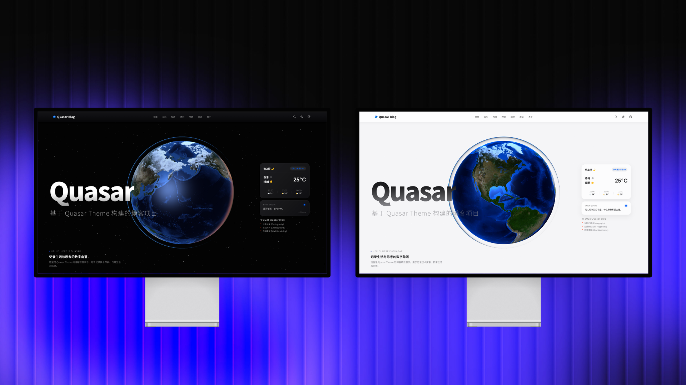
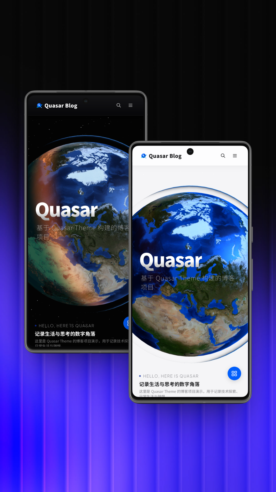

<div align="right">
  <a title="中文" href="/README-CN.md">中文</a>
</div>
<div align="left">


# 🌌 Quasar - A cosmic-inspired Astro theme

> A cosmic-inspired Astro theme grounded in Earth-like stability. Clean, performant, and crafted for a seamless blogging experience.
> 
> Built on Astro v7 without heavy runtime frameworks, powered entirely by pure CSS and Vanilla JS to deliver sub-millisecond response times and silky-smooth micro-interactions.

## ✨ Philosophy

Quasar is more than just a blog—it's your digital alter ego.

Leveraging Astro's Islands Architecture, Quasar squeezes every drop of frontend performance. Powered by meticulously crafted CSS `@keyframes` animations and non-blocking Vanilla JavaScript, it delivers exceptional SEO alongside an immersive seamless dark/light mode toggle, frosted glass parallax effects, and native-app-like View Transitions.

## 📸 Screenshots




📢 **Demo**: [Quasar Official](https://demo.singyan.top/) | [Singyan Blog](https://singyan.top/)

## 🚀 Core Features

Quasar is built with multiple highly autonomous, expressive channel modules:

* 📝 **Long-form Posts & Notes**
  * 100% type-safe Markdown rendering backed by Astro `Content Collections`.
  * **Notes:** Features a pure CSS-driven inline expansion and tag filtering system for a seamless, minimalist list layout.
* 📸 **Photo Albums**
  * Integrated Google Photos API (`GooglePhotosFetcher.ts`) for fetching cloud media.
  * A refined adaptive masonry layout with built-in `LazyLoad` and a global `Lightbox` gallery viewer.
* 💭 **Moments**
  * A Twitter/Moments-style microblogging feed with a custom sidebar, interactive likes (`MomentsLikeButton`), and expandable detail cards.
* 🎵 **Immersive Music Room**
  * A fully custom Vanilla JS audio player engine (`music-engine.js`).
  * Includes dynamic visualizer backgrounds (`MusicBackground`) and dual sidebar control panels.
* 🪐 **Interactive Home & Widget Ecosystem**
  * Homepage features an interactive 3D Globe (`Earth.astro`) and parallax hero text (`IntroWord.astro`).
  * Built-in widget suite: Weather (`WeatherWidget`), Studio Status (`StudioWidget`), and Quotes (`QuoteWidget`).
* 🤝 **Friends & Inter-site Relay**
  * Elegant modal dialogs powered by `GentleModal`.
  * Combines friend cards, site info panels, and a random inter-site jump gateway (`relay.js`) to build an interconnected web galaxy.
* 🛠️ **Internal Generator Suite**
  * Custom internal toolchain (`pages/generator/`) for one-click generation of SVG covers, favicons, and complete site color themes.

## 📂 Architecture

A modular, well-structured, and geek-friendly directory layout:

Plaintext

```
Quasar/
├── assets/                 # Core static asset engine
│   ├── scripts/            # Vanilla JS engine suite (music-engine, navbar-engine, intro-engine, etc.)
│   └── styles/             # On-demand CSS animation and layout modules (moments.css, notes.css, etc.)
├── components/             # Highly decoupled UI component library
│   ├── about/              # About page radar chart, tech stack showcase, floating Dock
│   ├── albums/             # Masonry gallery view and album headers
│   ├── common/             # Global infrastructure (Lightbox gallery, LazyLoad, ExternalLinkGuard)
│   ├── friends/            # Friend network and Gentle modal dialogs
│   ├── head/               # <head> injection (flash-free theme sync ThemePerfInit)
│   ├── moments/            # Moment cards, like button, and timeline sidebar
│   ├── music/              # Custom music player interface panels
│   ├── navbar/             # Global fuzzy search and top navigation hub
│   ├── notes/              # Pure CSS note list filter
│   ├── posts/              # Blog post views
│   ├── services/           # External API integrations (GooglePhotosFetcher)
│   └── widgets/            # Modular homepage widgets (Weather, Studio, etc.)
├── content/                # Content Collections data hub (Markdown)
│   ├── albums/ & friends/  
│   ├── moments/ & music/   
│   ├── notes/ & posts/     # Your articles and data source live here
│   └── Empty.md            # Structure placeholder
├── layouts/                # Core site layout frame (BaseLayout.astro)
├── pages/                  # File-based routing
│   ├── api/                # Serverless endpoints (e.g., albums.ts data fetching)
│   ├── generator/          # Local/Dev-only asset generator tools
│   ├── posts/              # Dynamic post route ([...slug].astro)
│   └── index, about, music, moments, friends, notes... # Main channel entries
├── utils/                  # Utility functions (clipboard, visibilityGuard, etc.)
├── config.ts               # Global variables, feature toggles, and base configuration
└── content.config.ts       # Astro Content Collections type definitions
```

## 🚀 Getting Started

Requires Node.js `v22.12.0` or higher. `pnpm` is recommended for faster dependency management.

**1. Clone the repository**

Bash

```
git clone https://github.com/<your-username>/Quasar.git
cd Quasar
```

**2. Install dependencies**

Bash

```
# Recommended
pnpm install

# Or using npm
npm install
```

**3. Start local development server**

Bash

```
# Using pnpm
pnpm dev

# Or using npm
npm run dev

# Open http://localhost:4321/ in your browser
```

**4. Build for production**

Bash

```
# Using pnpm
pnpm build

# Or using npm
npm run build
```

## ✍️ Content Management

Quasar separates content from code and requires no external CMS or database. All content is managed via Markdown files inside `src/content/`:

* **Posts:** Create Markdown files inside `content/posts/` and set frontmatter metadata.
* **Moments:** Write microblog entries in `content/moments/`.
* **Friends:** Edit friend link entries in `content/friends/`.
* **Music:** Add track info in `content/music/`.

*Fully integrated with TypeScript validation—missing or invalid frontmatter fields trigger build-time warnings to keep data completely safe.*

## ⚙️ Configuration

No need to dig deep into the codebase; 80% of site customization can be done directly via `config.ts` in the root directory, including:

* Site name and SEO metadata
* Navigation bar links and icons
* Sub-page (Music, Blog, Moments) copy and feature toggles
* Social media profile links

## 📜 License

Licensed under the [MIT License](https://mit-license.org/). Feel free to modify and distribute, provided the original copyright notice is preserved.

---

<div align="center">

*Architected with ❤️ by [SingyanLabs](https://github.com/singyanlabs) , powered by Google Gemini.*

**✨ If this theme helps you, please give us a ⭐ Star! ✨**

</div>

